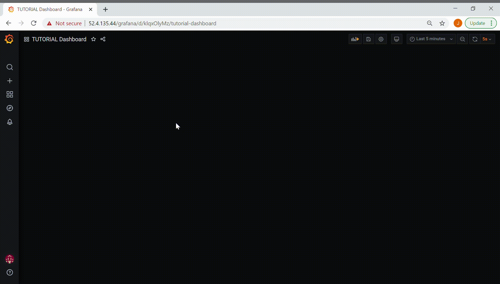
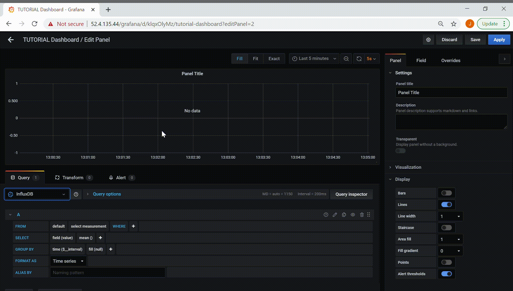

# MDML Examples
Try this example on [Google Collab](https://colab.research.google.com/drive/1mXs0CktMXB1Rd6GQfx4gynZ6Q4Gb7pRL?usp=sharing).

## Grafana Dashboard Tutorial

This tutorial will show how to:
* Log in to Grafana
* View your experiment's dashboard
* Add a data panel
* Connect to a data source
* Build a query
* View streaming data in real-time

#### Log in to Grafana
First, navigate to the Grafana webpage for your MDML instance at https://[MDML Hostname]/grafana. Log in with the same username and password you use to connect to the MDML. Congrats! You should have been successfully logged into Grafana.

#### View your experiment's dashboard
If your experiment's ID was associated with your account during registration, your dashboard will be the page shown upon logging in. If not, use the Search tool on the left hand side of the page to find your experiment's dashboard. They are named with the following format "[Experiment ID] Dashboard".

#### Add a data panel
Dashboards in Grafana are made up of panels. Panels can be added with a button in the top right of the page.

#### Connect to a data source
Grafana shows real-time data by connecting to and querying a data source. The MDML creates a user in its TimescaleDB (PostgreSQL) database for the Grafana data source to use. This database user has read-only access to data streamed under the corresponding experiment ID. Data sources are selected while creating a panel and are named with the following format "[Experiment ID] PostgreSQL".

#### Build a query
After adding a panel and selecting a data source, create a query to start viewing data. Data streamed from MDML devices are stored in a table with the following format "[Experiment ID] "  